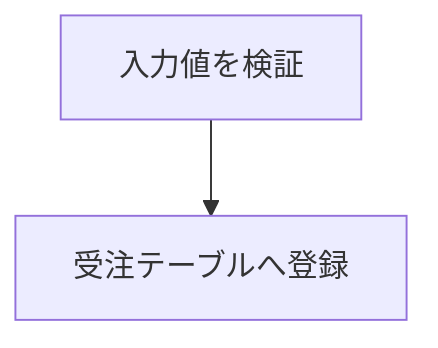
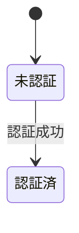
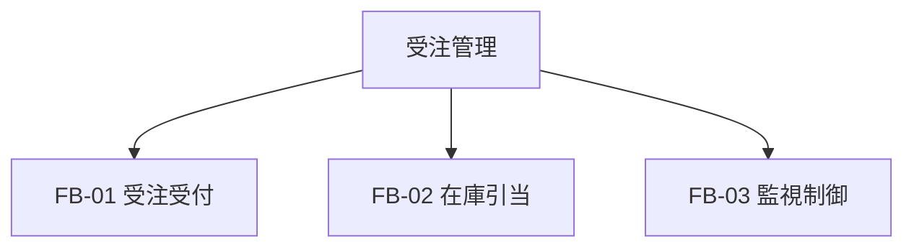
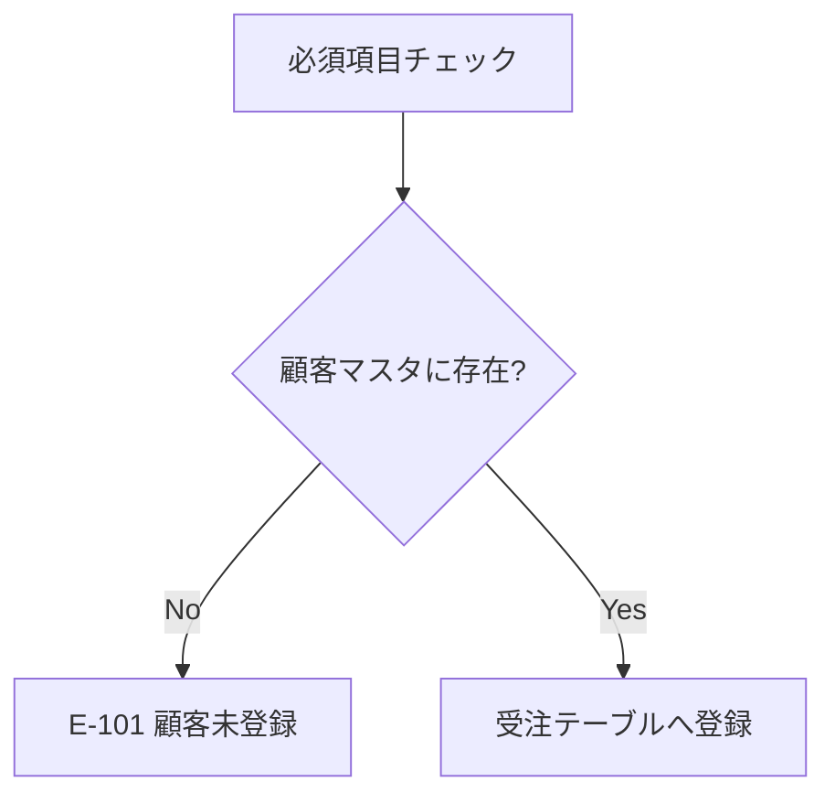

# AI エージェント向け 執筆ガイド — quarto-template（設計書テンプレート）

この文書は、**AI エージェントが利用マニュアル全体を読まずに**、このテンプレートで
設計書の原稿（Quarto book の `.qmd`）を書けるようにするための要約である。
設計書リポジトリの `AGENTS.md` / `CLAUDE.md` にそのまま貼る、あるいはスキルの
参照資料として同梱することを想定している。詳細は同梱の利用マニュアル
（`manual/利用マニュアル.pdf` / `manual/html/`）の該当章を参照する（各節末に章番号を示す）。

---

## 1. 何をするテンプレートか

- **原稿は Markdown（Quarto の `.qmd`）だけ**。様式（外枠・資料番号欄・図表番号・目次・IPO 図・
  横向きページ・表のページ分割）はテンプレートが付ける。**執筆者は様式を一切書かない。**
- 同じ原稿から 2 種類の出力が出る。

| 出力 | 作る人 | 道具 | 用途 |
|---|---|---|---|
| HTML（`_book/`） | 執筆者（AI を含む） | `quarto render` / `quarto preview` | 内容確認。章番号・図表番号・相互参照は PDF と一致 |
| PDF（`design-doc.pdf`） | 発行者 | `ddq pdf`（リリース同梱の `ddq.exe`） | 納品物。改ページ・横向き・様式は PDF でしか確認できない |

- **納品物は PDF が正**。HTML は確認手段。
- 組版は Quarto 同梱の Typst（LaTeX 不要）。図は mermaid / PlantUML を文字で書ける。

## 2. 執筆フォルダの構成と、触ってよいもの

```text
<リポジトリ>/                 … ddq init が作る。執筆者はここを clone する
├── .gitignore, .gitattributes, .vscode/settings.json, README.md
└── docs/                     … 執筆フォルダ（名前は自由。_quarto.yml があるフォルダ）
    ├── _quarto.yml           … 文書設定（表題・資料番号・章の並び）
    ├── index.qmd             … 前付け（採番しない章。改正履歴・用語）
    ├── chapters/             … 本文。章＝フォルダ／節＝サブフォルダ／項＝ファイル
    ├── diagrams/             … 画像（SVG/PNG）と、mermaid/PlantUML の変換キャッシュ
    ├── design-doc.pdf        … 中間版 PDF（発行者が更新してコミットする）
    ├── design-doc.lua        ┐
    ├── design-doc.css        │ 機構ファイル。ddq が置く写し。
    ├── postprocess-html.js   │ **編集しない**（ddq update / ビルドで上書きされる）
    ├── mermaid-config.json   │
    ├── plantuml-config.puml  │
    ├── .template-version     ┘
    ├── lib.typ, typst-*.typ, _quarto-publish.yml … 発行者環境にだけ現れる生成物。編集しない
    └── _book/                … 出力先（生成物。コミットしない）
```

**編集してよいもの**: `_quarto.yml`（章の並びなど）・`index.qmd`・`chapters/**/*.qmd`・`diagrams/` に置く画像。
**それ以外は触らない。**

`_quarto.yml` 先頭の表題・資料番号（`doc-number`）・改訂記号・会社名・`spec`・`plantuml-server` は
**発行者が決める設定**である。指示が無ければ雛形の値（または空）のままにし、推測で埋めない。
→ 4章

## 3. `_quarto.yml`（Quarto book の設定）

雛形（`ddq init` が置く）の要点。**PDF 用の `format:` 設定はここに書かない**（発行者側の
`_quarto-publish.yml` が持つ。書くと執筆者の `quarto render` が壊れる）。

```yaml
project:
  type: book
  output-dir: _book
  post-render:
    - postprocess-html.js      # HTML の図表番号を PDF と同じ「章.節-連番」に振り直す

book:
  title: ○○システム 基本設計書
  author: ○○チーム
  output-file: XX-2026-001_○○システム基本設計書   # 発行版 PDF の名前（拡張子なし）
  chapters:                    # ← 章の並び。1 行＝1 章。章のラッパー index.qmd だけを並べる
    - index.qmd                #    前付け（{.unnumbered}）
    - chapters/01-overview/index.qmd
    - chapters/02-design-policy/index.qmd

lang: ja
plantuml-server: ""            # LAN の PlantUML サーバ URL。空ならローカル 127.0.0.1:18080 を探す
doc-number: XX-2026-001        # 資料番号（発行者が決める）
doc-revision: ""               # 改訂記号 A〜Z / NC
spec: false                    # true でスペック様式（表題欄＋会社名フッター）
company-ja: ○○株式会社
company-en: ○○ Co., Ltd.
cover: false                   # true で表紙を出す
page-start: 1                  # PDF の開始ページ番号
pagebreak-level: 1             # 自動改ページ 0=なし 1=章 2=章と節
toc: true
toc-title: 目 次
toc-depth: 3

format:
  html:
    number-sections: true
    css: design-doc.css
    embed-resources: false

filters:
  - design-doc.lua
```

- **`chapters:` に無いファイルは出力されない**。章を足したら必ず 1 行足す。
- `chapters:` に `` で取り込む子ファイルを書かない（二重出力になる）。
- 章番号は `chapters:` の順で自動採番される（フォルダ名の `01-` は並び用で番号ではない）。
→ 4章

## 4. 章・節・項のファイル分割と `include`

### 分割の規約

| 見出し | 役割 | ファイル分割 |
|---|---|---|
| `#` | 章 | **必ずフォルダ**。ラッパーは `index.qmd`（節が無くてもフォルダ） |
| `##` / `###` | 節 / 項 | **子見出しを持つときだけ**フォルダ（ラッパー `index.qmd`）。子が無ければ `NN-name.qmd` |
| `####` / `#####` | 目 / 5段目 | 分けない。親ファイルに書く |

```text
chapters/
  01-overview/
    index.qmd            # 「# 概要」＋ include
    01-purpose.qmd       # 「## 目的」
    02-scope.qmd         # 「## 対象範囲」
  04-system/
    index.qmd            # 「# システム構成」＋ include
    01-hardware/
      index.qmd          # 「## ハードウェア環境」＋ include
      01-config.qmd      # 「### ハードウェア構成」
  05-requirements/
    index.qmd            # 節が無い章。本文も index.qmd に書く
```

### `index.qmd`（章ラッパー）の書き方

```markdown
# 概要 {#sec-overview}

本章では、システムの目的及び対象範囲を述べる。




```

取り込まれる側は節見出し（`##`）から書き始める。

### 守る規則（違反すると壊れる）

1. **章見出し `#` は必ず章の `index.qmd` に置く**。子ファイルに `#` を書かない。
2. **`include` のパスは「章の `index.qmd` があるディレクトリ」基準**。入れ子でも同じ。
   例: `04-system/01-hardware/index.qmd` の中で `01-config.qmd` を取り込むときは
   ``（ファイル自身からの相対ではない）。
3. 単体でレンダリングさせたくない断片（IPO のパートなど）は**ファイル名を `_` で始める**
   （例: `_ship-ipo-1.qmd`）。
4. `` の前後には空行を置く。
→ 7章

## 5. 基本記法（Markdown ＋ テンプレート固有）

| やりたいこと | 記法 | 注意 |
|---|---|---|
| 章/節/項/目 | `#` `##` `###` `####` `#####` | **番号は自動。`# 1. 概要` と書かない**。`#` の後に半角空白 |
| 採番しない章・節（前付け） | `# 本書について {.unnumbered}` | 節にも付ける。**採番しない章に番号付き図表を置かない**（図 0-1 になる） |
| 目次から外す | `## 見出し {.unlisted}` | 採番も止めるなら `{.unnumbered .unlisted}` |
| 章・節の参照 | 見出しに `{#sec-id}`、本文で `@sec-id` | 「5章」「5.3節」に解決。**「3章参照」と直書きしない** |
| 段落 | 空行で区切る | 字下げは自動。全角空白を入れない |
| 強調 | `**太字**` | **斜体は使わない**（日本語は PDF で傾かない）。`** 太字 **` は効かない |
| 等幅 | `` `code` `` | ファイル名・コマンド・記法 |
| 箇条書き | `- 項目`（入れ子は 4 空白字下げ） | **前の文との間に空行**が必要 |
| 項目に説明段落 | 項目の次に空行 → 4 空白字下げの段落 | 空行が無いと項目本文に連結される |
| 番号付きリスト | `1.` `2.` … | PDF では深さで `(1)`→`①`→`(ア)`→`a)`→`(a)` に自動切替。**記号を手で書かない** |
| チェックリスト | `- [x]` / `- [ ]` | |
| コードブロック | ```` ```yaml ```` 〜 ```` ``` ```` | 言語名は任意 |
| 注記ボックス | `::: {.callout-note}` 〜 `:::` | `note` / `tip` / `important` / `warning` / `caution`。`icon=false` で絵柄なし |
| 改ページ | ``（前後に空行） | **PDF のみ**。章の先頭は自動改ページなので不要 |
| 水平線 | `---` | ファイル先頭に置くと YAML と誤解される |
| リンク | `[表示](URL)` / `<URL>` | |

**未確定事項**は推測で埋めず、`::: {.callout-note}` に `【TBD】…（決定者／期限）` の形で明示する。
該当なしの節は見出しを残して「なし。」と書く。
→ 6章・7章

## 6. 図と相互参照

### 画像ファイル

```markdown
{#fig-arch width=55%}
```

- パスは**必ず執筆フォルダ基準の `/diagrams/...`**。`../diagrams/...` は Windows でビルドが壊れる。
- 画像は `diagrams/` に置く。SVG 推奨、PNG は 300dpi 以上。
- ID は `fig-` で始める。`width=` は本文幅に対する割合（任意）。

### mermaid（番号なし）

````markdown

````

### mermaid / PlantUML（番号付き・参照可）

````markdown
::: {#fig-auth-state}



認証状態遷移
:::
````

- `::: {#fig-id}` で囲み、**閉じ `:::` の直前の行がキャプション**になる。
- 図の大きさは指定しない（自動）。横に長い図は `.landscape` に入れる（§8）。
- PlantUML は ```` ```plantuml ```` フェンス。`@startuml`/`@enduml` は省略可。
  描画には **PlantUML サーバが要る**（`_quarto.yml` の `plantuml-server:` か、ローカルの
  `ddq plantuml serve`）。サーバが無い環境ではプレビューに橙枠でソースが出るだけで、
  PDF 生成は失敗する。サーバの有無が不明なら mermaid を優先する。
  図の種類ごとの実例はテンプレートのリポジトリの `examples/plantuml/`（プログラム概要設計書。
  12 章が記法例の付録）にある。
- PlantUML のアクティビティ図で `if` の中でスイムレーン `|名前|` を切り替えると、`endif` の後も
  そのレーンのまま。分岐後の処理は `endif` 直後にレーンを指定し直す（IPO の処理欄で起きやすい）。
- 横に長い図（参加者の多いシーケンス図・タイミング図）は本文幅に縮められて読めなくなる。
  `.landscape` に入れる。タイミング図は `scale 1 as 12 pixels` で 1 単位の幅を指定する。
- 主な mermaid: `flowchart TD/LR` / `stateDiagram-v2` / `sequenceDiagram` / `erDiagram` / `classDiagram` / `gantt`。
  決定表など表で表すべきものは mermaid でなく `.tbl`（グリッド表）で書く。

### 相互参照

| 書き方 | 出力 | ID の付け方 |
|---|---|---|
| `@fig-arch` | 図 3.2-1 | `{#fig-arch}` / `::: {#fig-arch}` |
| `@tbl-user` | 表 3.1-1 | `.tbl` / `.ipo` の `label="tbl-user"`、または `: キャプション {#tbl-user}` |
| `@sec-perf` | 5.3節（章なら 5章） | `## 見出し {#sec-perf}` |

- 接頭辞は **`fig-` / `tbl-` / `sec-` 固定**。違うと出力に「?」が残る。大文字小文字を区別する。
- 別ファイルの図表・見出しも参照できる。番号は自動で振り直されるので**本文に番号を直書きしない**。
- 図表番号は「章.節-連番」で節ごとにリセット。表と IPO 図は同じ連番列、図は別の連番列。
→ 8章

## 7. 表（統一テーブル `.tbl`）

**番号・参照・列幅・セル結合・分割が要る表は必ず `::: {.tbl …}` で囲む。** 設計書の一覧表は
原則すべて `.tbl` にする（素の表は番号なし・参照不可の補助用途に限る）。

```markdown
::: {.tbl caption="ユーザ属性一覧" label="tbl-user" widths="20,20,60" merge-cols="1"}
| 区分   | 属性   | 説明         |
|--------|--------|--------------|
| 基本   | 氏名   | 利用者の氏名 |
| 基本   | 年齢   | 満年齢       |
| 連絡先 | 電話   | 連絡先       |
:::
```

### `.tbl` の属性（すべて任意・併用可）

| 属性 | 効果 |
|---|---|
| `caption="…"` | キャプション。付けると採番される |
| `label="tbl-x"` | 相互参照 ID（`#` は付けない。付いていても除去される） |
| `widths="20,30,50"` | 列幅（％風でも比率でも可）。**個数＝列数**。合わないと警告して自動幅に戻る |
| `merge-cols="all"` / `"2,3"` | 縦に連続する同値セルを結合。左の列が結合済みのときだけ右も結合（階層結合） |
| `breakable-rows="true"` | 1 行が 1 ページに収まらないときだけ、行の途中で改ページを許す |
| `.unnumbered` | 番号を出さずキャプションだけ（連番を消費せず、参照不可）。前付けの表用 |

### パイプ表かグリッド表か（表単位で決める。混在不可）

| セルの中身 | 使う表 |
|---|---|
| 1 セル 1 行の文章だけ | **パイプ表**（縦棒 `\|` で列を区切る） |
| 改行・箇条書き・番号付きリスト・複数段落、横結合、マルチヘッダ | **グリッド表**（`+---+`） |

- パイプ表: 列揃えは区切り行のコロン（`:---` 左 / `:--:` 中央 / `---:` 右）。セル内改行は `<br>` のみ。
  **セルにリストは書けない**（`-` はただの文字になる）。
- グリッド表: セルの中に通常の Markdown を書ける。

```markdown
::: {.tbl caption="入出力データの内訳" label="tbl-io" widths="24,76"}
+--------------+----------------------------------------------+
| 項目         | 内容                                         |
+==============+==============================================+
| 入力データ   | - 受注番号\                                  |
|              |   （13 桁の数字）                            |
|              | - 顧客コード                                 |
+--------------+----------------------------------------------+
| 処理手順     | 1. 入力チェック                              |
|              | 2. 在庫引当                                  |
+--------------+----------------------------------------------+
:::
```

グリッド表の規則:

- 列境界は `+---+`、**ヘッダの終わりは `+===+`**。列揃えは `+===+` 行のコロン（ヘッダ無しなら最上段）。
- 横結合: セル間の `|` を書かない。縦結合: 行境界のそのセル部分を `+      +` と空白にする。
- リスト項目を分けるだけなら改行するだけ。**1 項目内や文章を折り返すときは行末 `\`**（または `<br>`）。
  単に行を分けただけでは連結される。
- **`|` と `+` の桁を上下で揃える**（全角文字は 2 桁）。罫線の見た目の幅と出力幅は無関係なので `widths=` を付ける。
- 手で横結合・縦結合を書いたグリッド表には `merge-cols` が効かない（安全側で無視）。

### 大きな表のページ分割

- 何もしなくてよい。PDF でページをまたぐとキャプションに「（1／3）」が自動で付き、列見出しも繰り返される。
- 分割位置を自分で決めたいときだけ、`.tbl` の中に**空行区切りで複数の表**を並べる
  （各パートに見出し行を書く。**全パートの列数を一致させる**）。結合セルの途中で割れると次ページが
  空欄から始まるので、分類の切れ目で区切り、表の直前に `` を置く。

### `.tbl` を使わない表

```markdown
| 属性 | 型 |
|------|----|
| ID   | 数 |

: キャプション {#tbl-x}
```

表の直後に空行を挟んで `: キャプション {#tbl-id}`。`.tbl` の `caption=` と併用しない。
列幅だけ付けたいときは `::: {widths="10,90"}` で囲む。
→ 9章

## 8. 横向きページと IPO 図

### 横向きページ

```markdown
::: {.landscape}
::: {.tbl caption="処理一覧" label="tbl-proc" merge-cols="all"}
| 大分類 | 中分類 | 処理名 | 入力 | 処理内容 | 出力 |
|--------|--------|--------|------|----------|------|
| … | … | … | … | … | … |
:::
:::
```

- 中身は通常の Markdown。閉じ `:::` は内側→外側の順に 2 つ。
- 列が 6 つ以上ある表、横長の図に使う。HTML では通常ページとして出る。

### IPO 図（入力・処理・出力の定型横向きページ）

````markdown
::: {.ipo module="受注管理" caption="受注処理の流れ" label="tbl-order-ipo"}
## 受注処理

### 入力

- 受注入力画面
- 顧客マスタ

### 処理


### 出力

- 受注ID
- 出荷指示書
:::
````

| 項目 | 指定 |
|---|---|
| 機能名 | `module=`（必須） |
| 処理名 | 最初の `##`（必須。この `##` は節にならない） |
| 表番号のタイトル | `caption=` |
| 参照 ID | `label="tbl-x"`（**表として採番**され `@tbl-x` で参照。本文の表と同じ連番列） |
| 欄 | `### 入力` `### 処理` `### 出力` の **3 つ固定**。他の見出しを書かない。中身は通常の Markdown |

- 複数パートに分けるときは `### 入力/処理/出力` のセットを繰り返す（「（1／N）」が自動で付く）。
- パートを別ファイルにするときは、囲み `::: {.ipo …}`〜`:::` を親に置き、各セットを
  `_name-ipo-1.qmd` のような `_` 始まりファイルにして ``（パスは章フォルダ基準）。
- 1 機能に複数の処理があるときは、同じ `module=` で IPO を処理ごとに並べる。
→ 10章

## 9. 前付け（`index.qmd`）と目次

```markdown
# 本書について {.unnumbered}

本書は○○システムの○○設計を記述したものである。

## 改正履歴一覧表 {.unnumbered}

| 改正番号 | 改正日     | 改正の根拠 | 改正の概要 |
|----------|------------|------------|------------|
| 基本版   | 2026-01-01 | 契約 C-000 | 新規制定   |

## 用語の説明 {.unnumbered}
…
```

- 前付けは執筆フォルダ直下の `index.qmd`。HTML のトップページになり、PDF では表紙の次に置かれる。
- 前付けの表は素の表（キャプションなし）か `::: {.tbl .unnumbered caption="…"}`。番号付き図表は置かない。
- 目次より前にページ（改正履歴など）を置きたいときだけ、`_quarto.yml` を `toc: false` にし、
  目次を出す位置に ```` ```{=typst} ```` ブロックで `#design-toc()` と書く（PDF のみ有効）。
→ 7章

## 10. PDF と HTML の違い・制限

| 項目 | PDF | HTML |
|---|---|---|
| 改ページ・横向き・表の「（i／n）」分割・外枠・資料番号 | 出る | 出ない（通常ページ・1 つの表） |
| 番号付きリストの記号 | `(1)`→`①`→`(ア)` | ブラウザ既定 `1.`→`a.` |
| 章番号・図表番号・相互参照 | 同じ | 同じ |

制限（回避策）:

- 見出しは 5 段まで（それ以上は箇条書き）。
- パイプ表にリスト・横結合・マルチヘッダは不可（グリッド表）。1 つの表で両方式を混ぜない。
- 採番しない章に番号付き図表を置けない（第 1 章以降に置く）。
- IPO の欄は入力・処理・出力の 3 つ固定。
- パスに CP932 に無い文字（絵文字・`〜` U+301C・アクセント付きラテン文字）を使えない。
- `typst compile` を直接呼ばない（アイコンが豆腐になる）。PDF は必ず `ddq pdf`。
→ 15章

## 11. コマンド

### 執筆者側（Quarto だけで動く。`ddq` 不要）

執筆フォルダ（`_quarto.yml` があるフォルダ）で実行する。

```bash
quarto render      # _book/ に HTML 一式。図表番号は PDF と同じ
quarto preview     # ブラウザでライブプレビュー（VSCode では Ctrl+Shift+K）
```

- book 全体がレンダリングされる（`chapters:` の全章）。
- 標準エラー出力の `[design-doc] 警告:` は記法の誤り（`widths` の個数不一致、`merge-cols` の指定誤りなど）。
- 出力中の「?」は未解決の相互参照（ID の綴り・接頭辞を確認）。
- mermaid はブラウザ内で描画される。PlantUML はサーバが要る。

### 発行者側（リリース展開フォルダ `quarto-template-<版>/` から、絶対パスで実行）

```bat
cd C:\tools\quarto-template-2.4.0
:: 設計書リポジトリを新規作成（執筆フォルダ docs）
.\ddq init C:\work\order-design
:: 同じリポジトリに 2 つ目の執筆フォルダを追加
.\ddq add C:\work\order-design\docs2
:: 機構ファイルをこの ddq の版に更新（--all <リポジトリ> で全執筆フォルダ）
.\ddq update C:\work\order-design\docs
:: PDF → docs\design-doc.pdf（発行版は docs\_book\<output-file>.pdf）
.\ddq pdf C:\work\order-design\docs
:: 配布 HTML → docs\_book\（mermaid / PlantUML を SVG に焼く）
.\ddq html C:\work\order-design\docs
:: diagrams\*.mmd *.puml → 同名 .svg（静的図）
.\ddq diagrams C:\work\order-design\docs
:: ローカル PlantUML サーバ（127.0.0.1:18080。Java が要る）
.\ddq plantuml serve
```

- `pdf` と `html` は同じ `_book/` を使うので、両方残すときは **PDF → HTML の順**。
- `pdf` / `html` は `.template-version` と機構ファイルが `ddq` と一致しないと止まる → `ddq update` してコミット。
- リリース一式は設計書リポジトリの**外**に置く（リポジトリ内に展開しない）。
→ 11章・12章

## 12. 書き終える前のセルフチェック

- [ ] 新しい章のフォルダ・`index.qmd` を作り、`_quarto.yml` の `chapters:` に足した
- [ ] `#`（章見出し）は章の `index.qmd` にだけある。子ファイルは `##` 以降から始まる
- [ ] `` のパスは章フォルダ基準。断片ファイルは `_` 始まり
- [ ] 見出し・図表に番号を手書きしていない（`# 1. 概要`、「図 3.2-1 に示す」は禁止）
- [ ] 参照 ID の接頭辞は `fig-` / `tbl-` / `sec-`。参照先に ID（`{#…}` / `label=`）がある
- [ ] `{.unnumbered}` の章に番号付き図表が無い
- [ ] 画像パスは `/diagrams/…`（`../` 無し）
- [ ] 一覧表は `.tbl` で囲んだ。`widths` の個数＝列数。分割パートの列数が一致
- [ ] リストを入れる表はグリッド表。パイプ表のセルに `-` を書いていない
- [ ] IPO の見出しは `## 処理名` ＋ `### 入力` `### 処理` `### 出力` だけ。`module=` がある
- [ ] `.landscape` の閉じ `:::` が 2 つある
- [ ] リストの前に空行、`#`/`-` の後に半角空白、`** **` の内側に空白なし、斜体を使っていない
- [ ] 発行者が決める設定（資料番号・会社名・`spec`）を勝手に埋めていない。未確定は TBD として明示した
- [ ] `quarto render` が通り、`[design-doc] 警告` と「?」参照が無い

## 13. 最小の完全な例

`docs/chapters/06-functions/index.qmd`:

```markdown
# 機能 {#sec-functions}

本章では機能ブロックと細部機能を述べる。


```

`docs/chapters/06-functions/01-structure.qmd`:

````markdown
## 機能構成 {#sec-fn-structure}

機能ブロックを @tbl-fb に、階層関係を @fig-fb-tree に、受注受付の処理を @tbl-fb01-ipo に示す。

::: {.tbl caption="機能ブロック一覧" label="tbl-fb" widths="12,24,64" merge-cols="1"}
| 区分 | 機能ブロック   | 機能概要                                 |
|------|----------------|------------------------------------------|
| 業務 | FB-01 受注受付 | 受注入力を検証し受注データとして登録する |
| 業務 | FB-02 在庫引当 | 受注に対し在庫を確保する                 |
| 管理 | FB-03 監視制御 | 稼働状態を監視し障害時に切り替える       |
:::

::: {#fig-fb-tree}



機能ブロックの階層関係
:::

::: {.ipo module="FB-01 受注受付" caption="受注受付処理" label="tbl-fb01-ipo"}
## F-011 入力検証／F-012 受注登録

### 入力

- 受注入力画面（SC-01）
- 顧客マスタ

### 処理



### 出力

- 受注データ（受注テーブル）
- エラーメッセージ
:::
````

`_quarto.yml` の `chapters:` に `- chapters/06-functions/index.qmd` を足す。

---

## 利用マニュアルの章との対応

| 内容 | 章 |
|---|---|
| 役割・全体の流れ | 1章 |
| 執筆環境（Quarto・VSCode 拡張・等幅フォント） | 2章・3章 |
| 執筆フォルダ・`_quarto.yml`・章立て | 4章 |
| プレビュー・HTML 確認・PDF との差 | 5章 |
| 基礎 Markdown | 6章 |
| 見出し・include・改ページ・前付け・目次 | 7章 |
| 画像・mermaid・PlantUML・相互参照 | 8章 |
| 表（`.tbl`・パイプ・グリッド・結合・分割・列幅） | 9章 |
| 横向きページ・IPO 図 | 10章 |
| 発行者環境（mermaid/PlantUML/更新/オフライン） | 11章 |
| PDF・HTML の出力・配布 | 12章 |
| 改訂履歴（ラベル付け・差分・修正内容） | 13章 |
| トラブル対処 | 14章 |
| 制限事項 | 15章 |
| 記法早見表 | 16章 |
