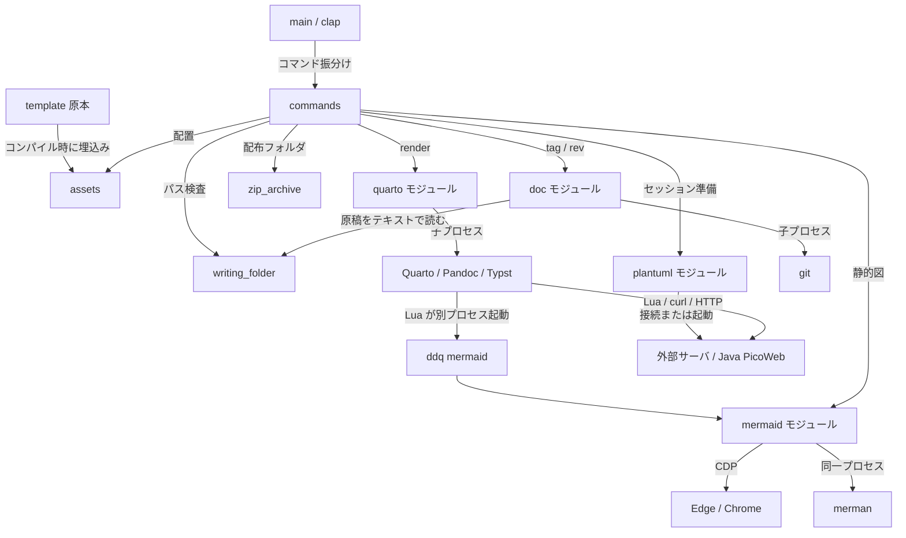

# 全体構造 {#sec-architecture}

## ビルドと実行の構成 {#sec-20eb5e}

**確認済み（静的）**：Cargo の binary ターゲット `ddq` は `src/main.rs` を入口とする。`template/` は実行時に隣接フォルダから読むのではなく、`include_str!`／`include_dir!` で実行ファイルに取り込む。実行時の文書入力は執筆フォルダに置き、更新時に埋込み資産を書き出す。[E-0003](appendix-evidence.qmd#ev-e-0003)

図の辺は静的確認済みの呼出し・データ供給を示す。`assets`・`doc` 等は ddq 内のモジュール、Quarto・ブラウザ・Java・git は別プロセスである。`doc` は Quarto を起動せず、`tag`／`rev` は描画経路と独立している。全コマンドが全経路を使うわけではない。[E-0002](appendix-evidence.qmd#ev-e-0002)、[E-0007](appendix-evidence.qmd#ev-e-0007)、[E-0009](appendix-evidence.qmd#ev-e-0009)、[E-0012](appendix-evidence.qmd#ev-e-0012)、[E-0020](appendix-evidence.qmd#ev-e-0020)

## 主要コンポーネント {#sec-02d92f}

以下はすべて静的確認済み。完全な関数一覧ではなく、変更の起点となる責務を示す。

| コンポーネント | 責務と読むシンボル | 主な利用先 |
|---|---|---|
| コマンド入口 | `main.rs::Cli / Command / main` | `commands::*::run`、`plantuml::serve` |
| 配置・版管理 | `assets::MECHANISM / PDF_SIDE / SCAFFOLD`、`setup::ensure_current` | init/add/update/setup/html/pdf |
| パス・探索 | `writing_folder::resolve / find_all / ensure_encodable` | main、作成・発行コマンド |
| Quarto起動 | `quarto::render / run / self_exe` | CWD、DDQ_BIN、終了状態の統一 |
| Mermaid変換 | `mermaid::choose_engine / render_jobs`、`browser::Cdp`、`merman_engine::render` | hidden CLI と diagrams |
| PlantUML連携 | `plantuml::ensure / Session / LocalServer / render` | html/pdf/diagrams/serve |
| 配布 | `release::run / build_extensions / build_extension / copy_tree`、`zip_archive::create` | manual、VSIX（拡張ごと）、jar、ZIP |
| 論理文書 | `doc::project::order / logical / Source`、`doc::units::scan`、`doc::scan_folder` | tag、rev |
| ラベル付与 | `commands::tag::list / apply / from_file`、`doc::labels::suggest / candidate / valid` | 執筆者、VSCode拡張 ddq-revision |
| 改訂履歴 | `commands::rev::next / diff_cmd / build`、`doc::diff::units_of / compare`、`doc::revfile`、`doc::gitsrc::Repo / GitFolder` | 執筆者、VSCode拡張 ddq-revision |

根拠：[E-0002](appendix-evidence.qmd#ev-e-0002)～[E-0014](appendix-evidence.qmd#ev-e-0014)、[E-0020](appendix-evidence.qmd#ev-e-0020)～[E-0022](appendix-evidence.qmd#ev-e-0022)。

## 所有権と並行性 {#sec-c724c4}

**確認済み（静的）**：通常のコマンド処理、図の描画、フォルダ更新は直列で進む。非同期ランタイムや自前のジョブキューはない。Mermaid の `Job` は入力／出力 `PathBuf` の対であり、ブラウザ経路は一つのバッチで一度起動し、図ごとに新しい CDP target を作る。merman は同一プロセスで Renderer を共用し順に描画する。[E-0009](appendix-evidence.qmd#ev-e-0009)

**確認済み（静的）**：`Session::External` は URL と任意の版だけを保持し、外部サーバを終了しない。`Session::Local` は `LocalServer` を所有する。通常のスコープ終了・エラー伝播で `Drop` が Java を kill/wait し、Windows では Job Object を閉じる。Java の stderr を読み続けるスレッドが一つ作られる。Windows では、JVM とヘッドレスブラウザの起動直後に `crate::job` の Job Object（`JOB_OBJECT_LIMIT_KILL_ON_JOB_CLOSE`）へ入れる。ハンドルは Drop で閉じるので、成功・エラーでの早期リターン・ddq 自身の強制終了のいずれでも、子とその孫がまとめて終わる。入れられなかった場合は子を kill してからエラーを返す。これらは故障注入で実行確認した（[U-0002](07-issues-unknowns.qmd#u-0002)）。[E-0011](appendix-evidence.qmd#ev-e-0011)、[E-0029](appendix-evidence.qmd#ev-e-0029)

**確認済み（静的）**：`doc::gitsrc` は `git` を同期の子プロセスとして一回ずつ起動し、標準出力を読み切ってから次へ進む。旧版の各ファイルは `git show` を一ファイル一回呼び、結果を `GitFolder` 内の `RefCell<HashMap>` に保持する。スレッドは作らない。[E-0022](appendix-evidence.qmd#ev-e-0022)

**確認済み（静的）**：自前コードには同じ執筆フォルダを操作する複数 ddq 間の排他がない。`tag apply` と `rev diff --write`／`rev build` も原稿・改訂ファイルを直接書き換えるため、VSCode 拡張と CLI を同時に動かす場合の整合は利用側に委ねられる。テスト内の `QUARTO_LOCK` は E2E テストの二経路を直列化するもので、製品のロックではない。[E-0016](appendix-evidence.qmd#ev-e-0016)
