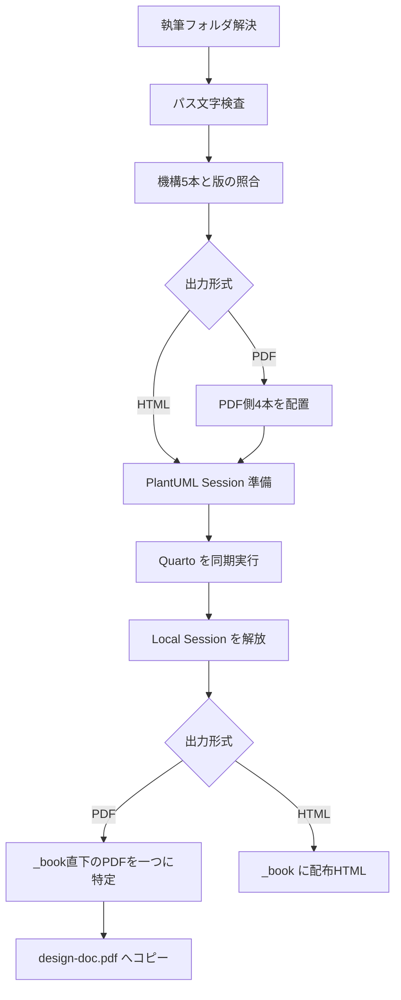

# 主要機能と処理の流れ {#sec-behavior}

## CLIの入口

**確認済み（静的）**：公開コマンドは `init`、`add`、`update`、`setup`、`html`、`pdf`、`diagrams`、`plantuml serve`、`release`。内部用の `mermaid` は help から隠されるが直接呼べる。`main.rs` の Args 定義が全引数の正本である。[E-0002](appendix-evidence.qmd#ev-e-0002)

| 用途 | 呼出形 | 既定・制約 |
|---|---|---|
| 新規作成 | `ddq init <repo> [name] [--no-render]` | name は `docs` |
| 文書追加 | `ddq add <folder> [--no-render]` | ancestor にリポジトリ目印が必要 |
| 機構更新 | `ddq update [folder]` または `ddq update --all <repo>` | folder と --all は排他 |
| 発行・準備・静的図 | `ddq setup/html/pdf/diagrams [folder]` | folder は CWD 基準の `docs` |
| 手動サーバ | `ddq plantuml serve [--port N] [--bind ADDRESS]` | `18080`、`127.0.0.1` |
| 配布物 | `ddq release [out-dir] [--with-sample] [--no-build]` | CWD はテンプレートのリポジトリルート |
| 内部変換 | `ddq mermaid -i <inputs...> -o <outputs...> [-c JSON] [-b COLOR]` | 入出力は同数、背景既定は transparent |

表の構文・既定値は静的確認済み。`setup/html/pdf/diagrams` は表を短くするための併記であり、一つずつ選ぶ。[E-0002](appendix-evidence.qmd#ev-e-0002)

## 作成・更新・版の検査

**確認済み（静的）**：`init::run` はフォルダ名が空、または `/`・`\` を含む場合に拒否し、パス文字を検査する。repo直下の雛形は既存ファイルを保持し、README内の `{{CONTENT_DIR}}` を置換する。その後 `add::populate` を直接呼ぶ。`git init` は実行せず、次の操作として表示する。[E-0005](appendix-evidence.qmd#ev-e-0005)

**確認済み（静的）**：`add::run` は親から上に `.gitignore`、`.git`、`.svn`、`.hg` のいずれかを探し、追加先に `_quarto.yml` があれば拒否する。`populate` は content雛形の不足ファイルを作り、`update::run` で機構を上書きし、通常は `quarto render --to html` による疎通確認を行う。`--no-render` は最後の描画だけを省略する。init の再実行は原稿を保持するが、機構まで保持する操作ではない。[E-0005](appendix-evidence.qmd#ev-e-0005)

**確認済み（静的）**：`update::run` は機構5本を書いた後、`.template-version` を書く。`--all` は指定先配下の `_quarto.yml` を探し、パス順に更新する。`_book`、`.quarto`、`node_modules`、`.git`、`target` は探索しないが、ddq専用の設定かどうかは判別しない。[E-0004](appendix-evidence.qmd#ev-e-0004)、[E-0006](appendix-evidence.qmd#ev-e-0006)

**確認済み（静的・限定実行）**：`setup::ensure_current` は `.template-version` を trim して埋込み版と比較し、機構5本を UTF-8文字列として完全比較する。版だけ合っていても、改行やローカル編集が違えば停止する。`setup::run` は検査成功後に PDF側4本を上書きする。機構を自動修復するのは update であり、setup/html/pdf は不一致を報告する。配置・不一致拒否は commands統合テストで確認した。[E-0006](appendix-evidence.qmd#ev-e-0006)、[E-0017](appendix-evidence.qmd#ev-e-0017)

## PDF／HTML発行

図は静的確認済みの成功経路。各段階のエラーは呼出元へ伝播する。通常のエラーでローカルセッションがスコープを抜けると `Drop` が走る。[E-0007](appendix-evidence.qmd#ev-e-0007)、[E-0011](appendix-evidence.qmd#ev-e-0011)

**確認済み（静的）**：PDF は `--to typst --profile publish`、HTML は `--to html` を渡す。HTMLでは `MERMAID_SVG=1` により図をSVG化する。PDFは `_book` 直下の拡張子PDFを大小文字を区別せず収集し、ちょうど一件の場合だけ `design-doc.pdf` にコピーする。ゼロ件・複数件ならエラーになる。`_book` 以外の output-dir に変えても、このコピー処理の参照先は変わらない。[E-0007](appendix-evidence.qmd#ev-e-0007)

**確認済み（静的）**：`plantuml::ensure` はまず最上位の設定済みサーバを probe し、失敗したら既定 `http://127.0.0.1:18080` を試す。その後で原稿中のPlantUMLフェンスを調べ、不要なら `Session::None`、必要なら空きポートでローカル起動する。したがって図がない文書でもサーバのprobeは先に発生する。静的 `.puml` だけを処理する diagrams は、None の場合もローカル起動する。[E-0008](appendix-evidence.qmd#ev-e-0008)、[E-0010](appendix-evidence.qmd#ev-e-0010)

## 図の変換

**確認済み（静的）**：`diagrams::run` は `diagrams/` 直下だけを調べ、小文字拡張子 `.mmd`／`.puml` を同名 `.svg` に変換する。Luaキャッシュに使う `mmd-`／`puml-` で始まる名前は除外する。フォルダ欠落はエラー、対象ゼロは警告を出して成功する。このコマンドには setup の版・機構照合はない。[E-0008](appendix-evidence.qmd#ev-e-0008)

**確認済み（静的）**：Mermaidは `DDQ_MERMAID_ENGINE=browser|merman` を優先する。未設定なら browser が見つかったときに選び、見つからなければ merman を選ぶ。`auto` という文字列は有効値ではない。ブラウザを選択した後の起動・描画失敗から merman へ再試行する実装もない。入力ファイルは全件読んでから描画し、図単位の失敗は成功分を書いた後にまとめてエラーにする。CDP接続等のバッチ全体のエラーでは、書出し段階へ到達しない。[E-0009](appendix-evidence.qmd#ev-e-0009)

**確認済み（静的）**：PlantUMLは共通設定を図の開始行の直後へ連結して HTTP POST する。通常の `@startuml` 以外の `@start...` も保持する。本文の改行はLF化し、開始行がなければ `@startuml`／`@enduml` を補う。図単位の描画エラーは集約するが、ファイルの読書き失敗は即時伝播する。diagrams は Mermaidを先に処理するため、その失敗時はPlantUML部分を実行しない。[E-0008](appendix-evidence.qmd#ev-e-0008)、[E-0010](appendix-evidence.qmd#ev-e-0010)

## 配布物の生成

**確認済み（静的）**：`release::run` は CWD に `template/VERSION` と `docs/manual/_quarto.yml` があることを要求する。通常はマニュアルを update→PDF→HTMLの順に作り、拡張の `name=ddq-table-editor` と埋込み版との一致を検査してVSIXを作る。`node_modules` がなければ `npm ci`、その後 `npm run package` を実行する。[E-0013](appendix-evidence.qmd#ev-e-0013)

**確認済み（静的）**：出力は `<out-dir>/quarto-template-<埋込み版>/` と同名ZIP。既存の同名配布フォルダは削除して再作成し、実行中のddq自身、README、AGENT-GUIDE、jar、はじめかたPDF、マニュアルPDF／HTML、VSIXを集める。`--with-sample` では `examples/docs` を `docs/` としてコピーし、生成物・PDF側補助・図キャッシュを除く。除外条件はコピー中のファイル名／接頭辞に適用される。[E-0013](appendix-evidence.qmd#ev-e-0013)

**確認済み（静的）**：`--no-build` はマニュアルとVSIXの作成を省略するが、存在・版の検査は残り、はじめかたPDFは引き続き `quarto typst compile` で作る。jarの版はMANIFESTから表示用に読むだけで、MIT版であることの自動検証はしない。ZIPの検証はファイル数であり、内容全体の照合ではない。[E-0013](appendix-evidence.qmd#ev-e-0013)、[E-0014](appendix-evidence.qmd#ev-e-0014)

## 失敗・中断後の状態

**確認済み（静的）**：コマンドは `anyhow::Result<()>` を main に返す。外部コマンドの非成功をエラーに変換し、子の終了コードは診断に含めるが、その値をddqの終了コードとして転送する専用処理はない。引数の誤りはclap、業務処理の失敗はanyhowに委譲する。利用側はまず成功／非成功で判断する。[E-0002](appendix-evidence.qmd#ev-e-0002)、[E-0007](appendix-evidence.qmd#ev-e-0007)

**確認済み（静的）**：一連のファイル更新にトランザクションや巻戻しはない。update途中の失敗では機構の新旧混在、init/addの描画失敗では配置済みファイル、図変換失敗では成功分と古いSVG、PDF発行失敗では以前の `design-doc.pdf` が残り得る。release途中の失敗では不完全な配布フォルダが残り、ZIP書込み途中の全エラーを削除する仕組みはない。再実行前に終了状態と生成物を併せて確認する。[E-0005](appendix-evidence.qmd#ev-e-0005)～[E-0009](appendix-evidence.qmd#ev-e-0009)、[E-0013](appendix-evidence.qmd#ev-e-0013)、[E-0014](appendix-evidence.qmd#ev-e-0014)
