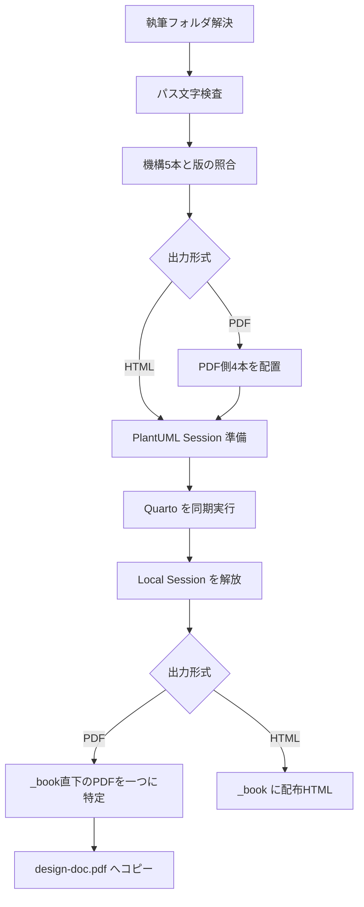
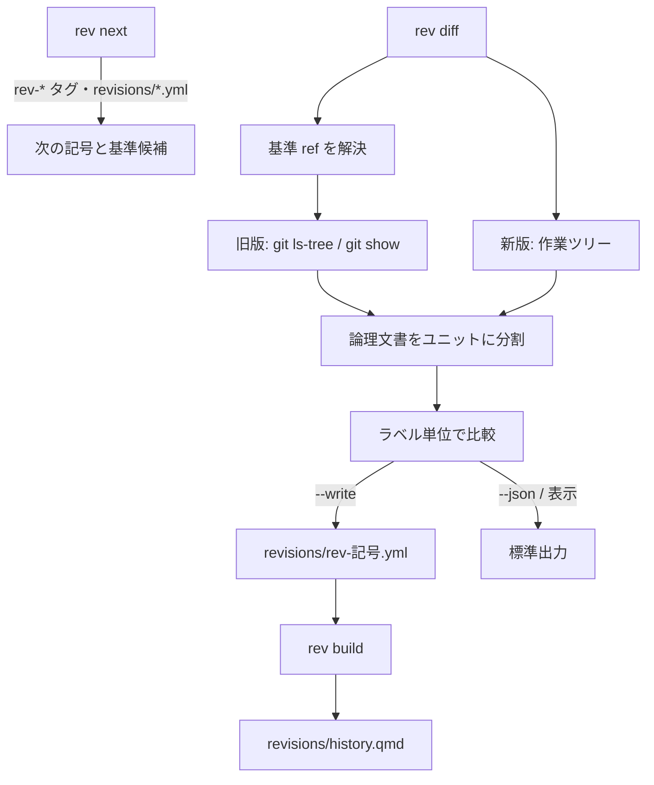

# 主要機能と処理の流れ {#sec-behavior}

## CLIの入口 {#sec-1e948b}

**確認済み（静的）**：公開コマンドは `init`、`add`、`update`、`setup`、`html`、`pdf`、`diagrams`、`plantuml serve`、`tag list／apply`、`rev next／diff／build`、`release`。内部用の `mermaid` は help から隠されるが直接呼べる。`main.rs` の Args 定義が全引数の正本である。[E-0002](appendix-evidence.qmd#ev-e-0002)

| 用途 | 呼出形 | 既定・制約 |
|---|---|---|
| 新規作成 | `ddq init <repo> [name] [--no-render]` | name は `docs` |
| 文書追加 | `ddq add <folder> [--no-render]` | ancestor にリポジトリ目印が必要 |
| 機構更新 | `ddq update [folder]` または `ddq update --all <repo>` | folder と --all は排他 |
| 発行・準備・静的図 | `ddq setup/html/pdf/diagrams [folder]` | folder は CWD 基準の `docs` |
| 手動サーバ | `ddq plantuml serve [--port N] [--bind ADDRESS]` | `18080`、`127.0.0.1` |
| ラベル一覧 | `ddq tag list [folder] [--json] [--unlabeled]` | folder は CWD 基準の `docs` |
| ラベル付与 | `ddq tag apply [folder] --all [--dry-run]`、または `--all` に代えて `--from FILE` | --all と --from は排他。どちらも無ければエラー |
| 改訂の準備 | `ddq rev next [folder] [--json]` | 次の改訂記号と比較基準の候補 |
| 改訂の差分 | `ddq rev diff [folder] [--base REF] [--json] [--strict] [--write]` | base 既定は最後の `rev-*` タグ |
| 改訂履歴表 | `ddq rev build [folder] [--check]` | `--check` は警告で非成功 |
| 配布物 | `ddq release [out-dir] [--with-sample] [--no-build]` | CWD はテンプレートのリポジトリルート |
| 内部変換 | `ddq mermaid -i <inputs...> -o <outputs...> [-c JSON] [-b COLOR]` | 入出力は同数、背景既定は transparent |
| 内部照会 | `ddq identity` | いまの環境（版・mermaid の見出し・フォントの指紋）を JSON で出す。フィルタが発行時に呼ぶ |

表の構文・既定値は静的確認済み。`setup/html/pdf/diagrams` は表を短くするための併記であり、一つずつ選ぶ。`tag apply` の「--all か --from のどちらか」は clap ではなく `main` の分岐で検査する。[E-0002](appendix-evidence.qmd#ev-e-0002)、[E-0020](appendix-evidence.qmd#ev-e-0020)

## 作成・更新・版の検査 {#sec-dda2e3}

**確認済み（静的）**：`init::run` はフォルダ名が空、または `/`・`\` を含む場合、または `.`／`..` の場合に拒否し、パス文字を検査する。repo直下の雛形は既存ファイルを保持し、README内の `{{CONTENT_DIR}}` を置換する。2.3.0 以降の content 雛形は `revisions/history.qmd`（コメント1行）を含み、`index.qmd` がそれを include する。その後 `add::populate` を直接呼ぶ。`git init` は実行せず、次の操作として表示する。[E-0005](appendix-evidence.qmd#ev-e-0005)

**確認済み（静的）**：`add::run` は親から上に `.gitignore`、`.git`、`.svn`、`.hg` のいずれかを探し、追加先に `_quarto.yml` があれば拒否する。`populate` は content雛形の不足ファイルを作り、`update::run` で機構を上書きし、通常は `quarto render --to html` による疎通確認を行う。`--no-render` は最後の描画だけを省略する。init の再実行は原稿を保持するが、機構まで保持する操作ではない。[E-0005](appendix-evidence.qmd#ev-e-0005)

**確認済み（静的）**：`update::run` は機構5本を書いた後、`.template-version` を書く。書く前の `.template-version` と埋込み版が違う（版を上げる）場合は、`diagrams/` 直下の `mmd-*`／`puml-*`（フィルタのキャッシュ）を消す。同じ版での再実行では消さない。`--all` は指定先配下の `_quarto.yml` を探し、パス順に更新する。`_book`、`.quarto`、`node_modules`、`.git`、`target` は探索しないが、ddq専用の設定かどうかは判別しない。[E-0004](appendix-evidence.qmd#ev-e-0004)、[E-0006](appendix-evidence.qmd#ev-e-0006)

**確認済み（静的・限定実行）**：`setup::ensure_current` は `.template-version` を trim して埋込み版と比較し、機構5本を UTF-8文字列として完全比較する。版だけ合っていても、改行やローカル編集が違えば停止する。`setup::run` は検査成功後に PDF側4本を上書きする。機構を自動修復するのは update であり、setup/html/pdf は不一致を報告する。配置・不一致拒否は commands統合テストで確認した。[E-0006](appendix-evidence.qmd#ev-e-0006)、[E-0017](appendix-evidence.qmd#ev-e-0017)

## PDF／HTML発行 {#sec-142c6f}

図は静的確認済みの成功経路。各段階のエラーは呼出元へ伝播する。通常のエラーでローカルセッションがスコープを抜けると `Drop` が走る。[E-0007](appendix-evidence.qmd#ev-e-0007)、[E-0011](appendix-evidence.qmd#ev-e-0011)

**確認済み（静的）**：PDF は `--to typst --profile publish`、HTML は `--to html` を渡す。HTMLでは `MERMAID_SVG=1` により図をSVG化する。PDFは `_book` 直下の拡張子PDFを大小文字を区別せず収集し、ちょうど一件の場合だけ `design-doc.pdf` にコピーする。ゼロ件・複数件ならエラーになる。`_book` 以外の output-dir に変えても、このコピー処理の参照先は変わらない。[E-0007](appendix-evidence.qmd#ev-e-0007)

**確認済み（静的）**：`plantuml::ensure` はまず最上位の設定済みサーバを probe し、失敗したら既定 `http://127.0.0.1:18080` を試す。その後で原稿中のPlantUMLフェンスを調べ、不要なら `Session::None`、必要なら空きポートでローカル起動する。したがって図がない文書でもサーバのprobeは先に発生する。静的 `.puml` だけを処理する diagrams は、None の場合もローカル起動する。[E-0008](appendix-evidence.qmd#ev-e-0008)、[E-0010](appendix-evidence.qmd#ev-e-0010)

## 図の変換 {#sec-f938ca}

**確認済み（静的）**：`diagrams::run` は `diagrams/` 直下だけを調べ、小文字拡張子 `.mmd`／`.puml` を同名 `.svg` に変換する。Luaキャッシュに使う `mmd-`／`puml-` で始まる名前は除外する。フォルダ欠落はエラー、対象ゼロは警告を出して成功する。変換に失敗した図は、出力先に前回の SVG があれば消す（Mermaid・PlantUML とも）。このコマンドには setup の版・機構照合はない。[E-0008](appendix-evidence.qmd#ev-e-0008)

**確認済み（静的）**：Mermaidは `DDQ_MERMAID_ENGINE=browser|merman` を優先する。未設定なら browser が見つかったときに選び、見つからなければ merman を選ぶ。`auto` という文字列は有効値ではない。ブラウザを選択した後の起動・描画失敗から merman へ再試行する実装もない。入力ファイルは全件読んでから描画し、図単位の失敗は成功分を書き、失敗した図の出力先にある前回の SVG を消してから、まとめてエラーにする。CDP接続等のバッチ全体のエラーでは、書出し段階へ到達しない。[E-0009](appendix-evidence.qmd#ev-e-0009)

**確認済み（静的）**：PlantUMLは共通設定を図の開始行の直後へ連結して HTTP POST する。通常の `@startuml` 以外の `@start...` も保持する。本文の改行はLF化し、開始行がなければ `@startuml`／`@enduml` を補う。図単位の描画エラーは集約するが、ファイルの読書き失敗は即時伝播する。diagrams は Mermaidを先に処理するため、その失敗時はPlantUML部分を実行しない。[E-0008](appendix-evidence.qmd#ev-e-0008)、[E-0010](appendix-evidence.qmd#ev-e-0010)

## 配布物の生成 {#sec-46f547}

**確認済み（静的）**：`release::run` は CWD に `template/VERSION` と `docs/manual/_quarto.yml` があることを要求する。通常はマニュアルを update→PDF→HTMLの順に作る。VSIX は `extensions/` 直下で `package.json` を持つフォルダをすべて対象とし、フォルダ名順に処理する（現行は `ddq-revision`、`ddq-table-editor`）。各拡張の `name` がフォルダ名と一致し、`version` が埋込み版と一致することを検査してから、`node_modules` がなければ `npm ci`、その後 `npm run package` を実行する。対象フォルダが一つもなければエラーになる。[E-0013](appendix-evidence.qmd#ev-e-0013)

**確認済み（静的）**：出力は `<out-dir>/quarto-template-<埋込み版>/` と同名ZIP。既存の同名配布フォルダは削除して再作成し、実行中のddq自身、README、AGENT-GUIDE、`THIRD-PARTY-NOTICES.md`、jar、はじめかたPDF、マニュアルPDF／HTML、拡張ごとのVSIXを集める。重いビルドの前に `THIRD-PARTY-NOTICES.md` の存在と、先頭に記録した入力（`Cargo.lock`・`mermaid.min.js`・`plantuml.jar`・拡張の `package-lock.json`）のSHA-1（テキストは改行をLFに揃えて計算）が今のファイルと一致することを確かめ、違えば止める。`--with-sample` では `examples/docs` を `docs/` としてコピーし、生成物・PDF側補助・図キャッシュを除く。除外条件はコピー中のファイル名／接頭辞に適用される。[E-0013](appendix-evidence.qmd#ev-e-0013)

**確認済み（静的）**：`--no-build` はマニュアルとVSIXの作成を省略するが、存在・name・版の検査は残り、はじめかたPDFは引き続き `quarto typst compile` で作る。jarの版はMANIFESTから表示用に読むだけで、MIT版であることの自動検証はしない。ZIPは書いた後に読み直し、全エントリの名前とバイト数を書いた内容と照合する。書込み途中の失敗や不一致では zip を削除する。バイト列そのものの比較や、同梱物が最新であることの確認ではない。[E-0013](appendix-evidence.qmd#ev-e-0013)、[E-0014](appendix-evidence.qmd#ev-e-0014)

## ラベル付与と改訂履歴 {#sec-4418e2}

**確認済み（静的）**：`tag` と `rev` は原稿を UTF-8 テキストとして読み（BOM は除去）、Quarto は起動しない。論理文書の順序は `doc::project` が `_quarto.yml` の `chapters:` と `appendices:`（付録）の配下にある `- <パス>.qmd|.md` を行ベースで拾い、行単独の `` をその場に再帰展開して作る。include の基準は入れ子でも章ファイルのディレクトリであり、循環と重複は警告にする。範囲は字下げが戻った行で終わり、`chapters:` の直後の `appendices:` からは付録の範囲が始まる。`_quarto.yml` が読めない、または一件も拾えない場合は、配下の qmd/md をパス順に並べる。[E-0020](appendix-evidence.qmd#ev-e-0020)

**確認済み（静的）**：`doc::units::scan` は行頭パターンだけで、見出し（`sec-`）、`.tbl`／`.ipo` div（`tbl-`）、表の前後に接するパイプ表キャプション行（`tbl-`）、`::: {#fig-…}` と行頭の画像 `{#fig-…}`（`fig-`）を拾う。キャプションはあるが ID の無い画像は `bare-figure` の警告とし、候補を出さない（ID を足すと番号付きの図になり、以降の図番号がずれるため）。キャプションも ID も無い画像は拾わない。front matter、コードフェンス内、`.tbl`／`.ipo`／`#fig-` div 内の見出しは除外する。キャプションもラベルも無い `.tbl` は `no-caption` 警告で対象外とする。見出しとパイプ表キャプションは、ID がちょうど一つで種別の接頭辞で始まる場合だけラベルとみなす。接頭辞の違う ID が一つある場合は `foreign-id`、ID が二つ以上ある場合は `multiple-ids` の警告とし、候補を出さず書き戻しもしない（Pandoc は ID を一つしか使わず、二つ目を足すとリンク先にならないため）。[E-0020](appendix-evidence.qmd#ev-e-0020)

**確認済み（静的・限定実行）**：`tag list` は、ラベルの無いものに候補と編集指示（ファイル・行・行頭からの**文字数**・挿入文字列）を付ける。候補は「ファイル相対パス・種別・正規化した文言」の SHA-1 先頭6桁で、既存ラベルと衝突すれば 8→10→40 桁に伸ばす。同じ入力なら同じ候補になる。`tag apply --all` は候補をすべて書き戻し、ファイルごとに行の後ろから挿入して、行末の CR を保持する。`--from` は `tag list --json` 全体または編集指示の配列を受け、行の不一致・既存ラベル・挿入位置超過・形式違反（接頭辞＋英数字・`-`・`_`）・重複のいずれかで、書込み前に全体を停止する。`--dry-run` は書き込まない。これらは `tests/tag.rs` で確認した。[E-0020](appendix-evidence.qmd#ev-e-0020)、[E-0017](appendix-evidence.qmd#ev-e-0017)

図は静的確認済みの成功経路。`rev diff` の「新版」は未コミットを含む作業ツリーであり、コミットとタグ付けは利用者が行う。[E-0021](appendix-evidence.qmd#ev-e-0021)、[E-0022](appendix-evidence.qmd#ev-e-0022)

**確認済み（静的）**：`rev next` は `git tag --list rev-*` から記号を集め、長さ→文字列の順で並べる。改訂ファイルの `scheme` が無ければ、既存記号がすべて数字なら `numeric`、それ以外は `alpha` とする。タグの無い改訂ファイル（書きかけ）があればその記号を使い続け、無ければ次の記号（`A→B`、`Z→AA`、数値は +1）を出す。基準候補は最後のタグで、無い場合 `rev diff` は `--base` を要求する。[E-0021](appendix-evidence.qmd#ev-e-0021)

**確認済み（静的・限定実行）**：`rev diff` は旧版と新版で同じ手順により論理文書を作り、ラベルごとの「ユニット」に切って本文を比べる。見出しは次の同位以上の見出しまで、`.tbl`／`.ipo`／`#fig-` はその div 内（属性行を含む）、画像の図はその1行、ラベルのあるパイプ表は接する表の行（空行1つまで挟んだ直前、無ければ直後）を本文とし、子ユニットの範囲は親に含めない。ラベルの無い見出し・表・図の中身は、ラベルを持つ直近の親見出しに帰属する。種別は `added`・`removed`・`changed`（本文の変化）・`renamed`（文言だけの変化）。比較前に改行コードは常に統一し、`--strict` が無ければ行内空白の連続と空行も無視する。出力順は新版の文書順で、`removed` は旧版で直前にあったラベルの後ろに挿す。ラベルの無い見出し・表・図は警告として表示し、`tag apply --all` で付くものと、既存の別形式の ID や複数の ID があって手で付け替えるしかないものとで案内を分ける。[E-0021](appendix-evidence.qmd#ev-e-0021)

**確認済み（静的・限定実行）**：`rev diff --write` は `revisions/rev-<記号>.yml` を作り直す。既存ファイルの `date` と、同じラベルの `note` を引き継ぐ。差分から外れたが `note` が空でない行は `stale: true` で残す。`--json` が無ければ更新件数と警告を表示し、`--json` があれば書き込んだ後に標準出力へ JSON だけを出す。[E-0021](appendix-evidence.qmd#ev-e-0021)、[E-0017](appendix-evidence.qmd#ev-e-0017)

**確認済み（静的・限定実行）**：`rev build` は `revisions/rev-*.yml`（`.yaml` も可）を記号順に読み、`stale` を除く行を新版の文書順に並べて `revisions/history.qmd` を上書きする。表は PDF 用（`content-visible when-format="typst"`、「頁」列に `_xref-page`）と HTML 用の二つを出力する。「箇所」は現存ラベルなら `@ラベル` の相互参照、削除済みなら名称と「削除」の表記になる。`note` が空の行、または `index.qmd` に include が無い場合は警告を出し、`--check` の場合は非成功で終わる。改訂ファイルが一つも無ければエラーとなる。[E-0021](appendix-evidence.qmd#ev-e-0021)

## 失敗・中断後の状態 {#sec-08b018}

**確認済み（静的）**：コマンドは `anyhow::Result<()>` を main に返す。外部コマンドの非成功をエラーに変換し、子の終了コードは診断に含めるが、その値をddqの終了コードとして転送する専用処理はない。引数の誤りはclap、業務処理の失敗はanyhowに委譲する。利用側はまず成功／非成功で判断する。[E-0002](appendix-evidence.qmd#ev-e-0002)、[E-0007](appendix-evidence.qmd#ev-e-0007)

**確認済み（静的）**：一連のファイル更新にトランザクションや巻戻しはない。update途中の失敗では機構の新旧混在、init/addの描画失敗では配置済みファイル、図変換失敗では成功分（失敗した図の前回SVGは消える。バッチ全体の失敗では前回の出力が残る）、PDF発行失敗では以前の `design-doc.pdf` が残り得る。release途中の失敗では不完全な配布フォルダが残る（ZIP は書込み途中の失敗でも削除する）。`tag apply` はファイル単位で書き込むため、途中の書込み失敗では書き込み済みのファイルだけが変わった状態になる（`--from` の検証は書込み前に全体で行う）。`rev diff --write`／`rev build` は一ファイルの上書きであり、一時ファイル経由の置換はしない。再実行前に終了状態と生成物を併せて確認する。[E-0005](appendix-evidence.qmd#ev-e-0005)～[E-0009](appendix-evidence.qmd#ev-e-0009)、[E-0013](appendix-evidence.qmd#ev-e-0013)、[E-0014](appendix-evidence.qmd#ev-e-0014)、[E-0020](appendix-evidence.qmd#ev-e-0020)、[E-0021](appendix-evidence.qmd#ev-e-0021)
