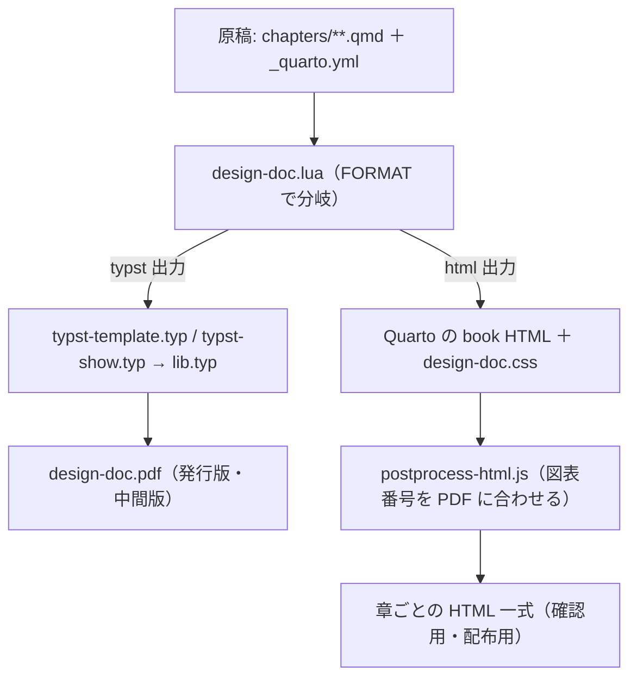

## 全体像 {#sec-pipeline-overview}

執筆者が書くのは `chapters/**.qmd` と、章の並びを決める `_quarto.yml` だけである。
`quarto render` が原稿を読み、Pandoc の Lua フィルタ（`design-doc.lua`）を通したあとで
Typst 出力と HTML 出力に分かれる。

::: {#fig-pipeline}

出力経路

:::

**同じ qmd から 2 系統が出る**のが要点である。執筆者の記法は完全に共通で、
分岐は `design-doc.lua` の `FORMAT` 判定 1 か所に閉じている。

::: {.tbl caption="2 系統の対応" label="tbl-two-outputs" widths="18,41,41"}
| 観点 | PDF（typst） | HTML |
|---|---|---|
| 様式 | `lib.typ` が外枠・資料番号欄・採番・改ページを描く | 様式は無い。`design-doc.css` で見た目だけ整える |
| 図表番号 | Typst のカウンタで「章.節-連番」 | Quarto の採番を `postprocess-html.js` で「章.節-連番」に振り直す（@sec-html-postprocess） |
| mermaid | ベクター SVG に焼き込んで `image()` | 既定はブラウザ内描画。配布 HTML は SVG 焼き込み（@sec-filter-mermaid） |
| PlantUML | PlantUML サーバに描かせた SVG を `image()` | 同じ（ブラウザ内描画が無いので、プレビューもサーバ。@sec-filter-plantuml） |
| 独自記法 | `#landscape[…]`・`#ipo(…)`・`#_tbl-auto[…]` など Typst の生ブロック | div 構造として組み立て直す（Typst の生ブロックは HTML で捨てられるため） |
| 用途 | 発行版・中間版（紙面の確認） | 執筆者の確認用・配布用 |
:::

### HTML を章ごとに分ける理由

設計書は 400〜1000 ページ規模になる。単一 HTML（`embed-resources: true`）では図が
base64 で内包され、**1000 ページ＋図 200 枚で約 27MB** になり閲覧も添付も破綻する
（実測: 本文のみ 288 ページで 2.1MB、図 1 枚あたり約 110KB）。

book 形式にすると、閲覧者が 1 ページで読むのは約 25KB、共通アセットは `site_libs/`
に 1 回だけ置かれ、全文検索（`search.json`）も自動で付く。ただしブラウザの制限により、
全文検索は HTTP サーバから開いたときだけ使える（`index.html` の直接表示では本文閲覧のみ）。
