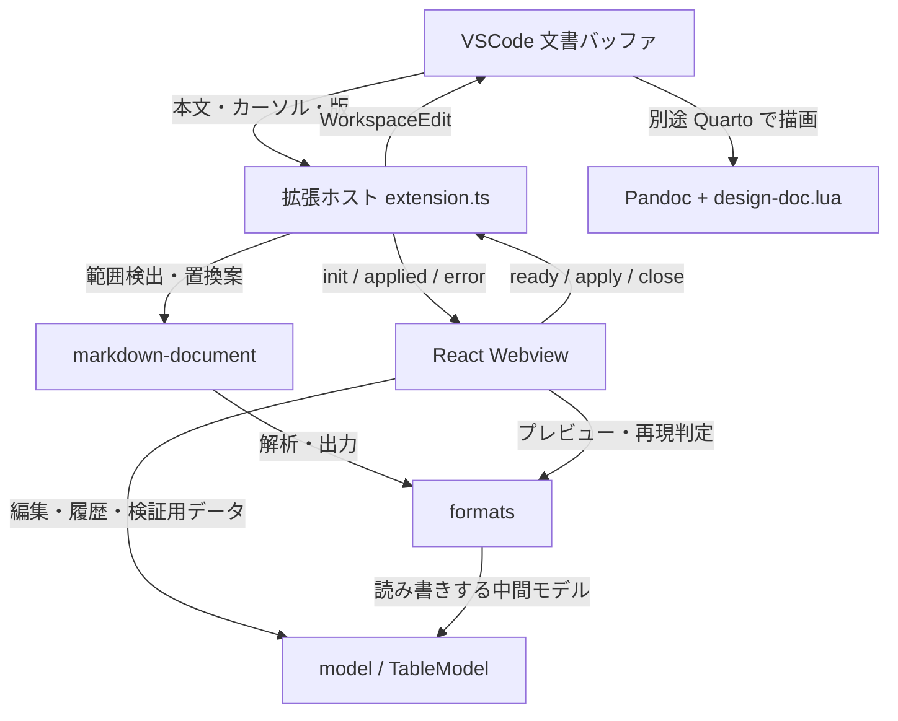

# 全体構造 {#sec-architecture}

## 構成と責務

確認済み（静的）：VSCode API を使用する拡張ホストと、React で描画する Webview を別々にバンドルする。両者は `TableModel` をメッセージで受け渡す。文書の読込・置換はホスト側、編集履歴・選択・入力ドラフトは Webview 側に置く。[E-0002](appendix-evidence.qmd#ev-e-0002)、[E-0005](appendix-evidence.qmd#ev-e-0005)、[E-0015](appendix-evidence.qmd#ev-e-0015)

矢印はデータの受渡しまたは利用方向を示す。すべて静的に確認した関係で、最後の描画は拡張が起動する処理ではない。根拠：[E-0002](appendix-evidence.qmd#ev-e-0002)、[E-0003](appendix-evidence.qmd#ev-e-0003)、[E-0005](appendix-evidence.qmd#ev-e-0005)、[E-0013](appendix-evidence.qmd#ev-e-0013)。

| 構成要素 | 所有する責務 | 主な入口 |
|---|---|---|
| `extension.ts` | コマンド、単一パネル、Session、文書版、CSP、Apply | `activate` / `applyToDocument` |
| `markdown-document/` | fence とパートの行範囲、対象選択、置換文字列 | `findEditTarget` / `buildReplacement` |
| `model/` | 矩形セル構造、結合、選択、履歴、TSV、検証 | `normalizeTableModel` / `validateTableModel` |
| `formats/` | pipe/grid/属性の解析・出力、merge-cols 再現判定 | `parseTableSource` から各パーサ、`serializeTblBlock` |
| `webview/TableEditor.tsx` | モデル履歴、ホスト通信、クリップボード、プレビュー | `TableEditor` |
| `webview/GridView.tsx` | セル表示、マウス・キー・IME、編集ドラフト | `GridView` |

`parseTableSource` 自体は `markdown-document/findEditTarget.ts` にある。画面の上位コンポーネントは出力形式やプレビューを扱うが、セル操作の中心は `TableModel` を操作する。[E-0003](appendix-evidence.qmd#ev-e-0003)、[E-0005](appendix-evidence.qmd#ev-e-0005)

## 起動と寿命

確認済み（静的）：`activate` がコマンドと破棄処理を `context.subscriptions` に登録する。コマンドの右クリックメニューは `.qmd` / `.md` かつ `editorTextFocus` の場合に表示される。ただし `openTableEditor` 内はアクティブエディタの有無を検査するだけで、拡張子を再検査しない。`activationEvents` は空配列、コマンドは `contributes.commands` に宣言されている。[E-0001](appendix-evidence.qmd#ev-e-0001)、[E-0002](appendix-evidence.qmd#ev-e-0002)

モジュール変数 `panel` と `session` は各1個。既存パネルがあれば再表示し、新しい対象の `init` を送る。新設時は `enableScripts` と `retainContextWhenHidden` を有効にし、Webview の `ready` を受けて `init` を返す。非表示中はコンテキストを保持するが、パネルを閉じるか拡張を停止すると両変数を破棄する。編集セッションを永続化する処理はない。[E-0002](appendix-evidence.qmd#ev-e-0002)

## ビルド境界と外部との関係

確認済み（静的）：esbuild は `extension.ts` を Node 18 ターゲットの CommonJS にし、`vscode` は外部モジュールとして残す。Vite は `webview/main.tsx` を IIFE にして React と変換処理を同梱する。ホストと Webview の両バンドルに共通処理が含まれても、メモリ上の状態を共有するわけではない。[E-0015](appendix-evidence.qmd#ev-e-0015)

実行時の外部境界は VSCode の文書・Webview API とクリップボードである。Pandoc と Lua フィルタは生成 Markdown の消費側で、拡張の通常動作における子プロセスではない。ネットワークを必要とする開発時の依存取得や監査と、配布拡張のオフライン動作は分けて考える。[E-0002](appendix-evidence.qmd#ev-e-0002)、[E-0014](appendix-evidence.qmd#ev-e-0014)、[E-0016](appendix-evidence.qmd#ev-e-0016)
