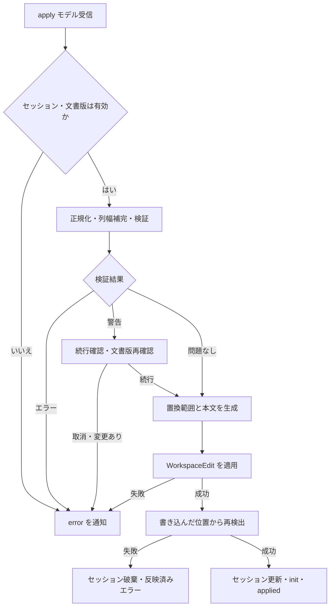

# 主要機能と処理の流れ {#sec-behavior}

## 編集対象の決定

確認済み（静的）：`findEditTarget` は文書全体を `scanFences` で走査した後、以下の順に対象を決める。行番号は0始まり、範囲の終端を含む。[E-0003](appendix-evidence.qmd#ev-e-0003)

| 優先 | 条件 | 結果 |
|---|---|---|
| 1 | カーソルを含む最も内側の `.tbl` | 空行区切りのパートを選び `tblPart` |
| 2 | カーソルが素の pipe / grid 表を構成する行 | 連続する表行を取り込み `plainTable` |
| 3 | 上記に該当しない | カーソル行の前へ挿入する `new` |

fence は3個以上のコロンで判定し、終了 fence が直近の開始 fence を閉じる。開始と終了のコロン数の大小比較はしない。孤立した終了 fence、未終了の開始 fence は文書内のどこにあってもエラーとなり、新規表にも進まない。Markdown のコードブロックを除外する構文解析は行わないため、記法例が検出へ影響する場合がある。[E-0003](appendix-evidence.qmd#ev-e-0003)、[E-0019](appendix-evidence.qmd#ev-e-0019)

`.tbl` 内の空行や fence 行にカーソルがある場合は最寄りのパートを選ぶ。同距離では先に走査したパートが残る。パート内に grid 罫線があれば grid を優先し、そうでなければ pipe の区切り行を探す。新規モデルは3行×3列、ヘッダ1行、先頭行が「列1」「列2」「列3」、初期 `outputFormat` は `gridTable` である。ただし実際の出力形式は第4章の条件で決まる。[E-0003](appendix-evidence.qmd#ev-e-0003)

## 画面編集とモデル更新

確認済み（静的）：`TableEditor.update` は次のモデルを正規化してスナップショット履歴へ積む。同一参照なら履歴に積まない。Undo の過去状態は最大100件、新規変更で Redo 側を消去する。選択範囲は履歴の対象外で、縮小した表に合わせて範囲を補正する。`init` の受信は履歴を作り直すため、Apply 後や別の表を開いた後に、それ以前の Webview 履歴を辿ることはできない。[E-0005](appendix-evidence.qmd#ev-e-0005)、[E-0008](appendix-evidence.qmd#ev-e-0008)

| 操作群 | 処理の要点と副作用 | 実装 |
|---|---|---|
| セル編集 | ドラフトを保持し、Enter / Tab / blur 等で1回だけモデル反映。Escape は破棄 | `GridView.tsx` |
| 選択・移動 | 結合元へ座標を解決。選択は交差する結合全体を含むまで拡張 | `selection.ts` |
| 結合 | 可視の非空本文を走査順に集め、同一文字列を重複排除して LF で連結。左上をアンカーにする | `mergeCells.ts` |
| 結合解除 | span を1へ戻す。本文を各セルへ再配分しない | `unmergeCell.ts` |
| 行列追加・削除 | 結合内部への挿入は span を延長。アンカー削除は残る下／右セルへ本文と span を継承 | `rowColOps.ts` |
| 消去・貼付 | 消去は結合を保持。TSV は必要な行列を増やし、hidden セルへの貼付値は捨てて件数を通知 | `clearCells.ts` / `tsvClipboard.ts` |

範囲外や既存結合を部分的に横断する結合要求はモデル関数が拒否する。UI は結合範囲を拡張した上でその関数を呼ぶ。最後の1行・1列の削除はモデル側で無操作にする。複数行を選択していても削除対象は選択先頭の1行／1列である。[E-0006](appendix-evidence.qmd#ev-e-0006)、[E-0007](appendix-evidence.qmd#ev-e-0007)

IME 入力を受ける textarea は常時1個で、選択時は1px、編集中はセル上に広げる。IME 変換中のキーは処理せず、文字入力で同じ要素を編集状態へ切り替える。Alt+Enter はキャレット位置へ LF を挿入する。フィルハンドルは範囲を伸ばすだけで値を複製しない。これらは静的確認であり、日本語 IME の実機操作は未確認である。[E-0006](appendix-evidence.qmd#ev-e-0006)

## Apply と再読込 {#sec-apply-flow}

確認済み（静的）：Apply は Webview のモデルをホストへ送信する。ホストは、閉じた文書や開始時から版が変わった文書を拒否し、正規化・列幅補完・検証後に置換する。[E-0002](appendix-evidence.qmd#ev-e-0002)、[E-0004](appendix-evidence.qmd#ev-e-0004)

図の判断と通知は `applyToDocument` の処理に対応する。再検出の失敗は、変更前の状態へ戻す処理ではない。[E-0002](appendix-evidence.qmd#ev-e-0002)

| 対象 | 書き戻す範囲 | 保持する範囲 |
|---|---|---|
| `new` | 空範囲へ `.tbl` 全体を挿入。周囲が非空行なら空行を補う | 元の文書行 |
| `plainTable` | 元の表全体を `.tbl` で囲んだ表へ置換 | 表の前後 |
| `tblPart`、1パート | 開始 fence から終了 fence までを再生成 | 外側 div・前後の本文 |
| `tblPart`、複数パート | 対象パート本体だけ | fence の属性、空行区切り、他パート、外側 div |

単一表の書き戻しでは開始 fence のコロン数を再利用し、終了 fence も同じ数で出力する。属性の綴り順・引用方法・字下げ等は再生成されるため、編集範囲内をバイト単位で保存する方式ではない。[E-0004](appendix-evidence.qmd#ev-e-0004)、[E-0009](appendix-evidence.qmd#ev-e-0009)

置換後は最初の非空行をアンカーに対象を取り直し、次回 Apply に古い行範囲を使わない。`workspace.applyEdit` の成功後に `init` と `applied` を送る。ファイル保存・バックアップ作成・自動リトライは実装していない。[E-0002](appendix-evidence.qmd#ev-e-0002)

## 異常時と並行処理

確認済み（静的）：label の不正、負の列幅、幅合計超過、補完できない一部幅指定等は書込み前に拒否する。非採番表の label と分割表の列数差は警告で、VSCode のモーダルで「続行する」を選べる。警告表示中の文書変更も再検査する。別パートが解析できず列数0になった場合は、列数不一致警告の比較対象から除外する。[E-0002](appendix-evidence.qmd#ev-e-0002)、[E-0010](appendix-evidence.qmd#ev-e-0010)

Apply ハンドラには `await` があり、グローバル Session に対する処理中フラグやメッセージのセッション識別子はない。通常経路の文書版拒否は確認できるが、Apply 連打や警告中に別表を開く操作の競合防止までは保証できない。例外全体を捕捉する `try/catch` もない。影響は [U-0001](07-issues-unknowns.qmd#u-0001) の実機確認事項とする。[E-0002](appendix-evidence.qmd#ev-e-0002)
