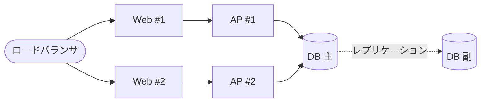

## 書くのは Markdown だけ

:::: {.columns}
::: {.column width="46%"}
````markdown
### ハードウェア構成

各装置の接続関係を @fig-hw に示す。

::: {#fig-hw}

ハードウェア構成
:::
````

::: {.caption}
原稿（`.qmd`）— 様式のことは何も書かない
:::
:::
::: {.column width="54%"}
{.paper}

::: {.caption}
出力 — 見出し番号・図番号・本文の参照が付いた紙面
:::
:::
::::

::: {.notes}
【0:30】左が原稿、右が出力。原稿に「4.1.1」「図 4.1.1-1」という文字は一度も
出てこないことを強調する。図も文字（mermaid）で書いている。
:::
