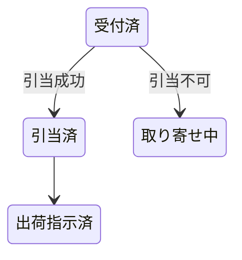

## 図：文字で書く（mermaid ／ PlantUML）、画像も可

:::: {.columns}
::: {.column width="50%"}
**mermaid** — フロー・状態遷移・ER など

````markdown
::: {#fig-state}

受注状態の遷移
:::
````
:::
::: {.column width="50%"}
**PlantUML** — シーケンス・クラス・アクティビティなど

````markdown
::: {#fig-seq}
```plantuml
actor 営業
営業 -> 受注登録: 受注入力
受注登録 -> 在庫引当: 引当要求
在庫引当 --> 受注登録: 結果
```
受注登録シーケンス
:::
````
:::
::::

- 画像は `{#fig-id width=55%}`
- PDF では mermaid を**ベクター SVG に焼き込み**（Windows 標準の Edge を headless で使用。Node.js 不要）
- PlantUML は LAN の描画サーバか、無ければ同梱 `plantuml.jar` を `ddq` がローカルの Java で起動

::: {.notes}
【1:00】図も diff が取れる、が要点。PlantUML だけはサーバが要る、と正直に言う
（LAN にあれば URL を書くだけ）。
:::
