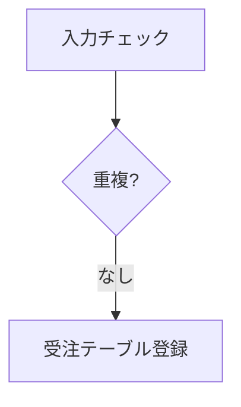

## 定型ページ：IPO 図と横向きページ

:::: {.columns}
::: {.column width="46%"}
````markdown
::: {.ipo module="受注登録"
     caption="受注登録処理" label="tbl-order-ipo"}
## 受注登録
### 入力
- 受注入力画面（顧客ID・商品・数量）
- 顧客マスタ ／ 商品マスタ
### 処理

### 出力
- 受注テーブル（1 件追加）
:::
````

- 横向きページは `::: {.landscape}` 〜 `:::` で囲むだけ
:::
::: {.column width="54%"}
{.paper}

::: {.caption}
IPO 図は横向きの定型様式に。入力／処理／出力を繰り返せば「（1／N）」で分割
:::
:::
::::

::: {.notes}
【0:45】「うちの様式にある定型ページも作ってある」の例として。
機能名・処理名・入力・処理・出力の枠は書かず、見出しで区切るだけ。
:::
