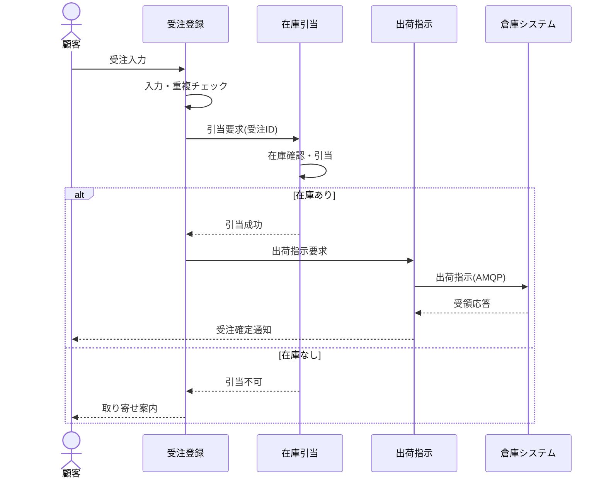

## 機能ブロックの相互関係

機能ブロック間のデータの流れと処理順序を @fig-func-seq に示す。受注登録から
出荷指示までの正常系の連携を、時系列で表す。

::: {#fig-func-seq}



機能ブロックの相互関係
:::

受注 1 件が連携の中でたどる状態を @fig-order-state に示す（PlantUML の状態遷移図）。

::: {#fig-order-state}

```plantuml
[*] --> 受付済 : 受注入力
受付済 --> 引当済 : 引当成功
受付済 --> 取り寄せ中 : 引当不可
取り寄せ中 --> 引当済 : 入荷
引当済 --> 出荷指示済 : 出荷指示(AMQP)
出荷指示済 --> 完了 : 受領応答
受付済 --> 取消 : 顧客取消
取り寄せ中 --> 取消 : 顧客取消
完了 --> [*]
取消 --> [*]
```

受注の状態遷移
:::
