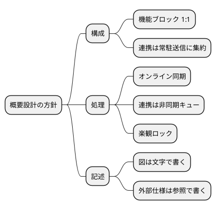

# 設計方針 {#sec-policy}

内部仕様を設計する上での基本的な考え方を、方針の内容とその理由のセットで示す。

## サブプログラムは機能ブロックに対応させる {#sec-policy-mapping}

サブプログラムは原則として機能ブロックと 1 対 1 に対応させる。対応しない箇所は
@sec-structure-mapping に理由を明記する。

**理由**: 基本設計書の機能ブロック単位で試験・保守・変更影響の追跡ができ、
上位設計への追跡可能性（@sec-eval）を保ちやすい。

## 他システム連携は常駐の送信サブプログラムに集約する {#sec-policy-resident}

倉庫管理システム（AMQP）・購買システム（REST）への送信は、業務のサブプログラムが
直接行わず、送信キュー（内部ファイル）を介して常駐の連携送信サブプログラムに任せる。

**理由**: 連携先の停止・遅延を業務の応答時間から切り離す（基本設計書の性能目標
「受注登録 2 秒以内」を、連携先の状態に依らず満たす）。再送・順序保証を 1 か所に
集められる。

## 在庫の排他は楽観ロックとする {#sec-policy-lock}

在庫引当の排他制御は、在庫テーブルの版番号による楽観ロックとし、競合したときは
引当処理を最大 3 回やり直す。

**理由**: 同一商品への同時引当は多くないため（負荷条件: ピーク 20 件/秒のうち同一商品は
1% 未満）、悲観ロックで DB のロック待ちを発生させるより総スループットが高い。

## 図は文字で書く {#sec-policy-diagram}

本書の図は PlantUML（UML 図）または mermaid で原稿に直接書き、画像を別に作らない。

**理由**: 図の差分を原稿と同じ pull request でレビューできる。設計変更のたびに
作図ツールへ戻る手間を無くす。設計方針の全体像を @fig-policy-map に示す。

::: {#fig-policy-map}

設計方針の全体像（マインドマップ）
:::
