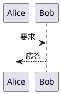
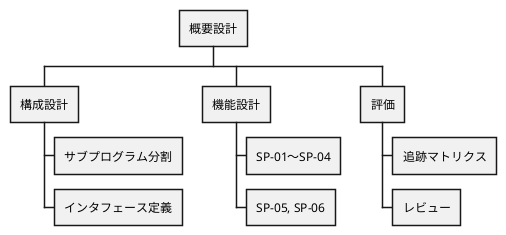

# PlantUML の記法例 {#sec-puml-examples}

本章は、本テンプレートで PlantUML を書くときの記法を実例で示す付録である（設計内容とは
関係のないサンプルを含む）。本文の各章に置いた図と合わせて、次の種類の図がこの文書に
そろっている。

::: {.tbl caption="本文に置いた PlantUML の図" label="tbl-puml-index" widths="24,40,36"}
| 図の種類           | 置いた場所                                  | 主な記法                             |
|--------------------|---------------------------------------------|--------------------------------------|
| ユースケース図     | @fig-usecase                                | `actor` / `usecase` / `<<include>>`  |
| マインドマップ     | @fig-policy-map                             | `@startmindmap` … `@endmindmap`      |
| コンポーネント図   | @fig-components, @fig-memory                | `[名前]` / `package` / `database`    |
| 配置図             | @fig-deploy                                 | `node` / `cloud` / `folder`          |
| シーケンス図       | @fig-sp-seq, @fig-sp03-seq, @fig-perf-seq   | `->` / `alt` / `loop` / `autonumber` |
| アクティビティ図   | @fig-activity, IPO 図の処理欄               | `start` / `if` / `repeat` / スイムレーン |
| 状態遷移図         | @fig-resident-state, @fig-line-state        | `[*] -->` / `state "表示名" as 別名` |
| クラス図           | @fig-sp01-class, @fig-ship-msg              | `class` / `interface` / `*--`        |
| オブジェクト図     | @fig-if01                                   | `object`                             |
| ER 図              | @fig-tb-er                                  | `entity` / `}o--||`                  |
| タイミング図       | @fig-sp06-timing                            | `robust` / `concise` / `@時刻`       |
:::

## 番号なしの図 {#sec-puml-plain}

番号も参照も要らない補助的な図は、` ```plantuml ` フェンスだけで書く。
`@startuml` / `@enduml` は省略できる。

```plantuml
Alice -> Bob : こんにちは
Bob --> Alice : こんにちは
```

## 番号付きの図と参照 {#sec-puml-numbered}

`::: {#fig-id}` で囲み、閉じ `:::` の直前の行をキャプションにする。本文からは
`@fig-id` で参照する（例: @fig-puml-simple）。

::: {#fig-puml-simple}



`@startuml` を明示した例
:::

## 図ごとの見た目の上書き {#sec-puml-skin}

共通の見た目（レイアウトエンジン・フォント・背景）は `plantuml-config.puml` が各図の
先頭に自動で連結される。特定の図だけ変えたいときは、図の中に `skinparam` を書く
（@fig-puml-skin）。`title` を図の中に書くこともできるが、番号付きのキャプションとは
別物なので、通常はキャプションだけにする。

::: {#fig-puml-skin}

```plantuml
skinparam monochrome true
skinparam sequenceMessageAlign center
participant "受注受付" as a
participant "在庫引当" as b
a -> b : 引当要求
note right : この図だけ単色にした
b --> a : 引当結果
```

図の中の `skinparam` で単色にした例
:::

## 注釈・グループ・色 {#sec-puml-note}

`note` で注釈を、`group` / `box` でまとまりを、`#色` で強調を付けられる（@fig-puml-note）。

::: {#fig-puml-note}

```plantuml
box "受注管理システム" #f4f4f4
  participant "SP-01" as sp1
  participant "SP-03" as sp3
end box
participant "倉庫管理\nシステム" as wms #ffe0b2

sp1 -> sp3 : 引当要求
note over sp1, sp3 : 同一トランザクション
group 非同期
  sp3 -> wms : 出荷指示
  note right of wms #ffffcc
    連携先の停止は
    業務の応答に影響しない
  end note
end
```

注釈・グループ・色の例
:::

## 横に長い図 {#sec-puml-landscape}

参加者の多いシーケンス図など横に長い図は `::: {.landscape}` に入れると、PDF では
横向きページに置かれる（@fig-puml-wide）。閉じ `:::` は内側→外側の順に 2 つ書く。

::: {.landscape}
::: {#fig-puml-wide}

```plantuml
actor 営業担当 as u
participant "画面" as ui
participant "SP-01\n受注受付" as sp1
participant "SP-03\n在庫引当" as sp3
participant "SP-04\n出荷指示編集" as sp4
database "受注 DB" as db
queue "IF-01" as q
participant "SP-06\n連携送信" as sp6
participant "倉庫管理\nシステム" as wms
participant "購買\nシステム" as pur

u -> ui : 入力
ui -> sp1 : 登録要求
sp1 -> db : 受注登録
sp1 -> sp3 : 引当要求
sp3 -> db : 在庫更新
alt 全明細引当
  sp3 -> sp4 : 出荷指示要求
  sp4 -> q : 出荷指示
else 不足あり
  sp3 -> q : 補充依頼
end
sp1 --> ui : 結果
ui --> u : 表示
q -> sp6 : 取り出し
sp6 -> wms : 出荷指示 (AMQP)
sp6 -> pur : 補充依頼 (REST)
```

横向きページに置いた広いシーケンス図
:::
:::

## 静的な図として持つ {#sec-puml-static}

原稿に埋め込まず、`diagrams/*.puml` にソースを置いて `ddq diagrams` で SVG に変換し、
画像として貼ることもできる（@fig-puml-static）。複数の文書で同じ図を使い回すときや、
図のソースを別の担当者が管理するときに向く。

```markdown
{#fig-puml-static width=70%}
```

{#fig-puml-static width=70%}

## 作業分解図 {#sec-puml-wbs}

`@startwbs` で作業分解図（WBS）を書ける。マインドマップと同じく、行頭の `*` の数で階層を表す
（@fig-puml-wbs）。

::: {#fig-puml-wbs}



作業分解図（WBS）の例
:::

## 注意事項 {#sec-puml-notes}

- 描画には PlantUML サーバが要る。サーバに届かないときプレビューには橙色の枠でソースが
  出るだけで、`ddq pdf` / `ddq html` はエラーになる。サーバの有無が不明なら mermaid を使う。
- 構文エラーはビルド時に「フェンス内 n 行目付近」と報告される。行番号は原稿のフェンス内の
  行である。
- `@startmindmap` / `@startwbs` / `@startjson` のように `@startuml` 以外で始まる図は、その
  開始行から書く（共通設定はその直後に連結される。`@startjson` でも問題ない）。
- 図の大きさは指定しない（本文幅に合わせて自動で縮む）。横に長い図は `.landscape` に入れる。
- 日本語のラベルはそのまま書ける。参加者名に空白や記号を含むときは `"表示名" as 別名` の形にする。
